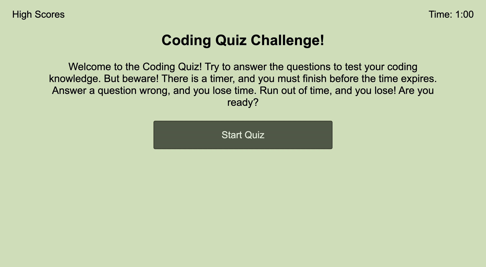

# Code-Quiz

## GT Bootcamp - Module 4 Challenge: Code Quiz

This week's challenge built on the basics of using Javascript that we learned last week, but added DOM manipulation. The challenge required creating a dynamic website that changed its structure and content based on user input and interaction. On top of that we were building this page from scratch.

We were asked to make a simple quiz that asked trivia questions about coding. There needed to be a timer, and if the user got a question wrong, the quiz needed to subtract time from the timer. When the quiz is over, the user is able to enter their score. The score is then entered into local storage, and then when the user visits the high score page, they are able to see all the previous high scores. This meant the quiz also needed to be able to be reset and played again.

This challenge moved well beyond anything we had done up until this point. The first step involved creating multiple "pages" that are dynamically altered within the JavaScript code. I knew that I could have used JavaScript to create the entire page from scratch, but it seemed that a simpler approach (at least for me) would be to create all the elements in the HTML, then hide, reveal, and change the content of those elements dynamically.

Once I had the basic structure of the pages laid out, I had to figure out how to move dynamically between them. This ended up being a very intersting and challenging task. After many revisions, I ultimately settled on seperating out functions for various stages of the quiz. I also discoverd that the event listening functions needed to be separated on their own. Finally, I needed the timer to run in the background in its own function. The ultimate structure of navigating between all these different functions taught me a lot about how to lay out code in an efficient way, so that errors are less likely and the code is easier to debug.

This was a fun exercise, and the level of complexity required surprised me. But in the end, getting it working was very rewarding.

## [Deployed Application](https://mmmphoto.github.io/Code-Quiz/)
## [Github Respository](https://github.com/MMMPhoto/Code-Quiz)

#### © 2022 Max McDonough
